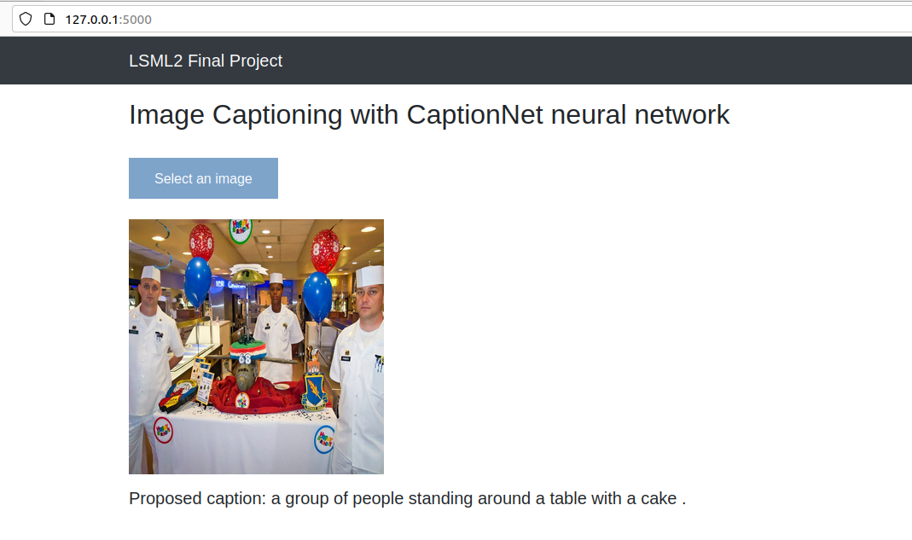
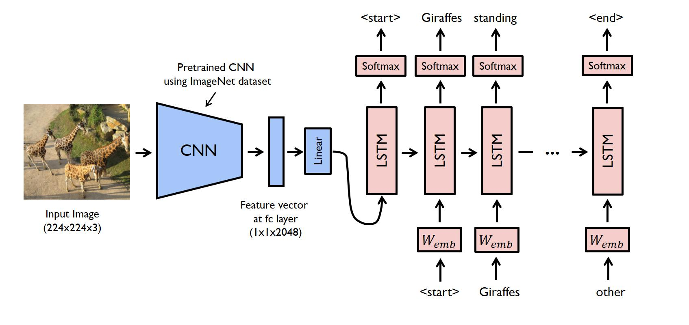

# Image Captioning

## Description:

This project provides a tool for image captioning. In order to construct computer-generated natural descriptions of images we apply state-of-the-art model that merges recent computer vision and language models into a single jointly trained model.



## The Captioning Model:


  
The model was trained on vecrotized images from MSCOCO dataset and coresponding text descriptions.


## Required infrastructure:

- Docker: a set of PaaS products that use OS-level virtualization to deliver software in packages called containers
- Docker Compose: a tool for defining and running multi-container Docker applications


## How to install:

```bash
$ git clone ...
$ cd project_directory
$ docker-compose build
$ docker-compose up
```
After the installation the following services are available:
- http://localhost:5000 Web Application for image captioning 
- http://localhost:4000 Jupyter Lab for training the model
- http://localhost:6000 MLFlow Server for tracking model training runs and storing model artifacts


## Architecture:

The project includes the following services:
- **Flask:**   Web Server
- **Celery:**  Asynchronous task queue for Flask web application
- **Redis:**   In-memory key-value database and a message broker for Celery
- **Jupyter:** Jupyter Lab for model training
- **MLFlow:**  MLFlow Server for tracking model training runs and storing model artifacts


## How to train the Captioning Model:

- Start Jupyter Lab at http://localhost:4000
- Open **train_CaptionNet.ipynb** notebook from the project's directory
- Run all cells in the notebook
- Restart all project services
